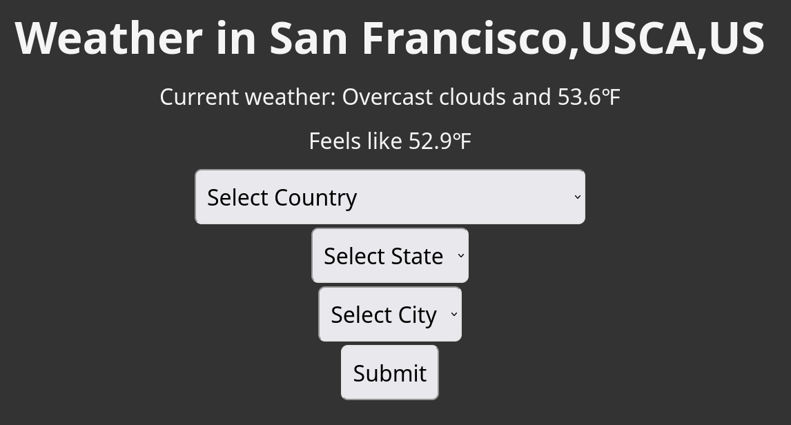

# Flask Weather Getter

  

## Table Of Contents

- [Description](#description)
- [Deployed website link](#deployedWebsite)
- [Installation](#installation)
- [Usage](#usage)
- [GitHub](#github)
- [License](#license)

  

## Description

  Flask application to retrieve current weather data from api.openweathermap.org

Deployed website: <strong><a href="https://flaskweathergetter1-tsm7m4yv.b4a.run/">https://flaskweathergetter1-tsm7m4yv.b4a.run/</a></strong>

   
Weather retrieved for San Francisco,CA,US

## Installation

1. Clone the repository to your local machine with `git clone https://github.com/robertlent/flask_weather_getter.git`
2. Create a virtual environment in the project folder and activate it using `python3 -m venv venv && source venv/bin/activate`
3. Install dependencies using `pip3 install -r requirements.txt`

Flask Weather Getter is built with the following tools and libraries: <ul><li>Flask</li> <li>Python</li> <li>JavaScript</li> <li>HTML</li> <li>CSS</li></ul>

## Usage
 
1. Start the Flask server with `python3 server.py`
2. Navigate to 0.0.0.0:8000 in your browser
3. Choose a Country, then a State, then a City.

## GitHub

<a href="https://github.com/robertlent"><strong>robertlent</a></strong>

## License

